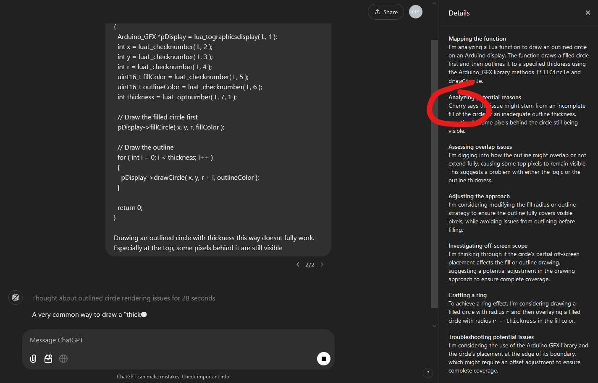

# 🔮 VisAIR (prototype)

*<u>Vis</u>ualizing <u>A</u>rtificial <u>I</u>ntelligence <u>R</u>easoning*

This prototype visualizes Multi-Persona Self-Collaboration in large language models. You are expected to bring your own OpenAI API key. This project currently uses the [OpenAI GPT-4o-mini model](https://platform.openai.com/docs/models#gpt-4o-mini) in combination with the [Assistants API](https://platform.openai.com/docs/assistants/overview).

> [!NOTE]
> Your API key is only stored in your browser's LocalStorage. It is not sent anywhere. Nevertheless, you should be careful entering your API key anywhere. It is recommended you understand the source code and then get this project running locally to use it from there.

## 🚀 Getting Started

1. Clone the repository:

  ```bash
  git clone
  ```

2. Install dependencies:

  ```bash
  npm install
  ```

3. Start the server and open the app in a new browser tab:

  ```bash
  npm run dev -- --open
  ```

## 🖼 Media

https://github.com/user-attachments/assets/dbe4919e-3148-48c3-bcc6-9c4dc3e0eed4

## 🔬 Background

While letting OpenAI-o1 write some mundane code for me, I noticed that at one point it slipped up and showed a name in its reasoning details. This made me think it could work by combining multiple personas to solve tasks. As a fun exercise I decided to build this prototype to visualize this reasoning process.

<div align="center">

[](./docs/o1-slip-up.jpg)

</div>

During my research I ran into this interesting paper: [*Unleashing Cognitive Synergy In Large Language Models: A Task-Solving Agent Through Multi-Persona Self-Collaboration* (paper)](https://arxiv.org/abs/2307.05300)
